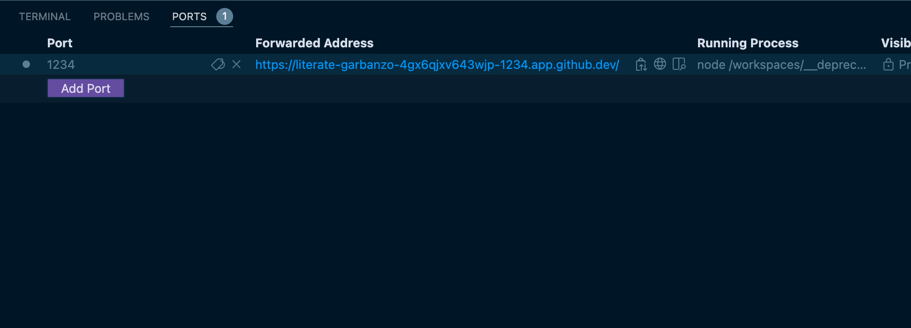

# r3edge Primer React Template | 

**Un template de démarrage pour React, suralimenté pour des déploiements multi-plateformes fluides.**

> 🚀 **Pourquoi utiliser ce template ?**
>
> ✅ **Fondation Solide** : Basé sur le template officiel [Primer React](https://primer.style/react/) de GitHub.  
> ✅ **Développement Rapide** : Profitez de l'écosystème Vite pour une expérience de développement instantanée.  
> ✅ **Déploiement Universel** : Pré-configuré pour un déploiement en un clic sur Vercel, Netlify et GitHub Pages.  
> ✅ **Environnement Conteneurisé** : Entièrement compatible avec GitHub Codespaces pour un environnement de développement reproductible.  
> ✅ **Qualité de Code** : Intègre ESLint et Prettier pour maintenir un code propre et cohérent.  

---

## 📋 Fonctionnalités clés

- ✅ **Stack Moderne** : React 19 + Vite.
- ✅ **UI Robuste** : Intégration complète du système de design [Primer React](https://primer.style/react/).
- ✅ **Routage Standard** : Utilise `react-router-dom` pour un contrôle total et une flexibilité maximale.
- ✅ **Déploiement Simplifié** : Fichiers de configuration `vercel.json` et `netlify.toml` inclus.
- ✅ **Workflow CI/CD** : Action GitHub prête à l'emploi pour construire et déployer sur GitHub Pages.
- ✅ **Environnement Isolé** : Configuration Devcontainer pour une expérience de développement cohérente dans VS Code et Codespaces.

---

## ⚙️ Démarrage Rapide

### Option 1 : GitHub Codespaces (Recommandé)

1.  Cliquez sur **Use this template** > **Open in a codespace**.
2.  Une fois le codespace initialisé, le terminal s'ouvrira. Les dépendances seront installées automatiquement.
3.  Le serveur de développement démarrera. Allez dans l'onglet **PORTS** et ouvrez l'URL publique pour voir votre application.



### Option 2 : Développement Local

Vous devez avoir Node.js (version spécifiée dans `.nvmrc`) et Yarn installés sur votre machine.

1.  Clonez le dépôt sur votre machine locale :
    ```bash
    git clone https://github.com/VOTRE_USER/VOTRE_REPO.git
    cd VOTRE_REPO
    ```

2.  Installez les dépendances :
    ```bash
    npm install
    ```

3.  Lancez le serveur de développement :
    ```bash
    npm run dev
    ```

4.  Ouvrez votre navigateur et allez sur `http://localhost:1234`.

---

## 🚀 Plateformes de Déploiement

Ce projet est configuré pour être déployé automatiquement sur les plateformes suivantes.

-   **GitHub Pages** : Déployé via l'action GitHub incluse.
    -   URL de déploiement : `https://dsissoko.github.io/r3edge-primer-react/`

-   **Vercel** : Liez votre dépôt à un nouveau projet Vercel. La configuration `vercel.json` sera détectée automatiquement.
    -   URL de déploiement : `https://r3edge-primer-react.netlify.app/`
> 

-   **Netlify** : Liez votre dépôt à un nouveau site Netlify. La configuration `netlify.toml` sera détectée automatiquement.
    -   URL de déploiement : `https://r3edge-primer-react.netlify.app/`

---

[](https://github.com/dsissoko/r3edge-primer-react/actions/workflows/dependabot/dependabot-updates)
[](https://github.com/dsissoko/r3edge-primer-react/actions/workflows/deploy.yml)
[](https://app.netlify.com/projects/r3edge-primer-react/deploys)


📫 Maintenu par [@dsissoko](https://github.com/dsissoko) – Ce projet est une évolution du template officiel [Primer React](https://github.com/primer/react-template).