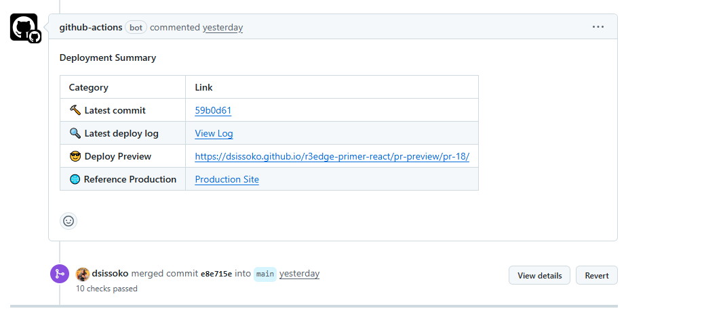

# r3edge Primer React Template | 

**A starter template for React, supercharged for seamless multi-platform deployments.**

> 🚀 **Why use this template?**
>
> ✅ **Solid Foundation**: Based on GitHub’s official [Primer React](https://github.com/primer/react-template) template.  
> ✅ **Universal Deployment**: Pre-configured for one-click deployment to Vercel, Netlify, GitHub Pages, and Docker Hub.  
> ✅ **Modern CI/CD Pipeline**: One commit triggers one build and one deploy. Each Pull Request generates preview environments accessible on Vercel, Netlify, and GitHub Pages.  
> ✅ **Modern Development Environment**: Fully compatible with GitHub Codespaces or local development in VSC.  
> ✅ **Bot Usage**: Keep dependencies always up to date with Dependabot, and code your features using Gemini CLI or Open Hands.  

Ce README est également disponible en Français 🇫🇷 ici: [👉 docs/README_fr.md](docs/README_fr.md)

---

## 📋 Key Features

- ✅ **Modern Stack Template**: React 19 + Vite + Primer.  
- ✅ **Standard Routing**: Uses `react-router-dom` for full control and maximum flexibility.  
- ✅ **Simplified Deployment**: Includes `vercel.json` and `netlify.toml` config files.  
- ✅ **CI/CD Workflow**: Ready-to-use GitHub Action to build and deploy on GitHub Pages.  

---

## ⚙️ Quick Start

Click **Use this template** > **Create a new repository**.  
Choose your project name and visibility.  

> ⚠️ GitHub Pages does not work with free private repositories.  

### For Development

- With CodeSpaces:

    `<> Code` > `Codespaces` tab > `Create codespace on main`

- With local VSC:  

    ```bash
    git clone https://github.com/YOUR_USER/YOUR_REPO.git
    cd YOUR_REPO
    ```
    Open VSC and launch a terminal, then:
    ```bash
    npm install
    npm run dev
    ```
---

### First Build & Deploy

Once your repo is created, GitHub will generate a first commit titled “Initial commit” and push it to `main`. This push automatically triggers the `deploy.yml` workflow.  
This action runs 4 jobs:  
 1. Build the React code.  
 2. Deploy to production on GitHub Pages.  
 3. Deploy a preview on GitHub Pages.  
 4. Build a container and upload it to Docker Hub.  

For the first commit, since your repository is not yet configured, the Docker job fails, and the preview job is skipped (only triggered on Pull Requests).  
Therefore, the "Deploy & Preview" workflow fails, which is expected until you configure your GitHub repo to unlock all the features of **r3edge-primer-react**.


### 📌 Post-Cloning Configuration

#### 1. GitHub Pages Setup (Crucial)

This template uses a deployment strategy with a dedicated `gh-pages` branch.  
This is the most robust way to handle both production and temporary preview environments for Pull Requests.

**Concept of the `gh-pages` branch:**  
- Your `main` branch holds the **source code** of your app (React, JSX, etc.).  
- The `gh-pages` branch contains the **compiled, ready-to-serve website** (pure HTML, CSS, JS).  
- The GitHub Actions workflow compiles `main` and automatically pushes the result to `gh-pages`.  

**Required Actions:**  

1. Go to your repo’s settings: `Settings` > `Pages`.  
2. In `Build and deployment`, under `Source`, select **`Deploy from a branch`**.  
3. Configure:  
   - **Branch**: `gh-pages`  
   - **Folder**: `/(root)`  
4. Click **Save**.  

This tells GitHub to serve the content of `gh-pages` as your website.  

#### 2. Workflow Secrets Configuration

The workflow needs secrets to connect to external services like Docker Hub.  

1. Go to: `Settings` > `Secrets and variables` > `Actions`.  
2. Add the following repository secrets:  
   - `DOCKERHUB_USERNAME`: Your Docker Hub username.  
   - `DOCKERHUB_TOKEN`: A [Docker Hub personal access token](https://hub.docker.com/settings/security) with `Read & Write` permissions.  

The `GITHUB_TOKEN` is automatically provided by GitHub and requires no setup.  

#### 3. Vercel and Netlify Configuration

This template is ready for deployment on Vercel and Netlify.  

1. Create a new project on Vercel or Netlify.  
2. Connect your GitHub repo.  
3. These platforms automatically detect the config files (`vercel.json` or `netlify.toml`) and apply the correct build settings (`npm run build`) and output directory (`dist`).  

> **Important Note for Vercel:**  
> By default, Vercel attempts to build *every* branch, including `gh-pages`.  
> This fails since `gh-pages` contains a pre-built site, not source code.  
>
> To fix this:  
> 1. Go to `Settings` > `Git` in your Vercel project.  
> 2. Find **Ignored Build Step**.  
> 3. Paste this command:  
>     ```bash
>     if [[ "$VERCEL_GIT_COMMIT_REF" == "gh-pages" ]] ; then exit 0; else exit 1; fi
>     ```
> 4. Save. This cleanly cancels builds for `gh-pages` without error.  

PR previews are automatically supported by Vercel and Netlify, no extra setup needed.  

#### 4. Preview Lifecycle & Cleanup

- **Vercel:** Lifecycle tied to the Git branch. Deleting the branch after merging a PR deletes all previews.  
- **Netlify:** Lifecycle tied to the PR itself. Closing or merging the PR deletes the preview.  
- **GitHub Pages (our solution):** **No automatic cleanup.** Preview folders (e.g., `/pr-preview/pr-123/`) persist even after PR closure. This is intentional for history keeping but can be modified to include cleanup if needed.  

#### 5. Workflow Triggers

- **Push on `main`**: Triggers production deployment.  
- **Pull Request to `main`**: Triggers preview deployment.  

#### 6. Production Actions (on `main`)

1. **Deploy to GitHub Pages**: The site updates on its main branch.  
   - Production URL: [https://dsissoko.github.io/r3edge-primer-react/](https://dsissoko.github.io/r3edge-primer-react/)  
2. **Publish to Docker Hub**: A new Docker `latest` image is built and pushed.  

#### 7. Pull Request Previews

- Each Pull Request automatically gets a **preview version** deployed at a unique URL.  
- The workflow posts a **comment in the PR** with the direct preview link for instant visual review. Example: [https://dsissoko.github.io/r3edge-primer-react/pr-preview/pr-19/](https://dsissoko.github.io/r3edge-primer-react/pr-preview/pr-19/).  



### 📌 Container Deployment (Docker)

#### 1. Requirements

1. **Docker**: Installed and running.  
2. **Docker Hub Auth**: A Docker Hub account, logged in via terminal.  

#### 2. Initial Setup (one-time)

1. **Create your config file:**  
    ```bash
    cp docker/.env.example docker/.env
    ```
    Edit `docker/.env` to include your Docker Hub username.  

2. **Login to Docker Hub:**  
    ```bash
    docker login
    ```

#### 3. Build the Image

1. Make the build script executable:  
    ```bash
    chmod +x docker/build.sh
    ```
2. Run the script:  
    ```bash
    ./docker/build.sh
    ```

#### 4. Run the Container

```bash
docker run -p 8080:80   -e BACKEND_API_URL="https://your-app.domain.com/api"   yourusername/r3edge-primer-react:latest
```

Open [http://localhost:8080](http://localhost:8080).  

---

## 📦 Reference Stack

✅ This app relies on:  

- Node 20 (Docker build)  
- React 19.1 + React DOM 19  
- Vite 7 + `@vitejs/plugin-react`  
- Primer React 37 & `@primer/octicons-react`  
- React Router DOM 7  
- Styled-components 5  
- ESLint 9 + PostCSS 10  
- Nginx (production server)  

---

## 🗺️ Roadmap

### 🔧 Next
- Unit test examples (Vitest + React Testing Library)

### 🧠 Under Consideration
- AI bots Open Hands and Gemini CLI

---

📫 Maintained by [@dsissoko](https://github.com/dsissoko) – This project is an evolution of the official [Primer React](https://github.com/primer/react-template) template.  

[](https://github.com/dsissoko/r3edge-primer-react/actions/workflows/dependabot/dependabot-updates) [](https://github.com/dsissoko/r3edge-primer-react/actions/workflows/deploy.yml) [](https://app.netlify.com/projects/r3edge-primer-react/deploys)
