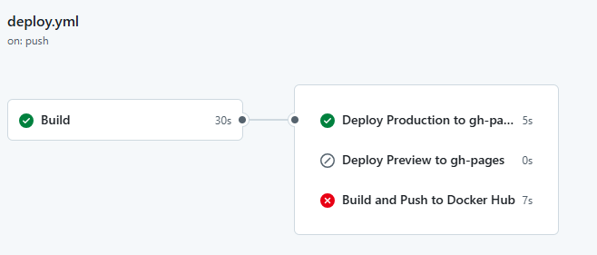
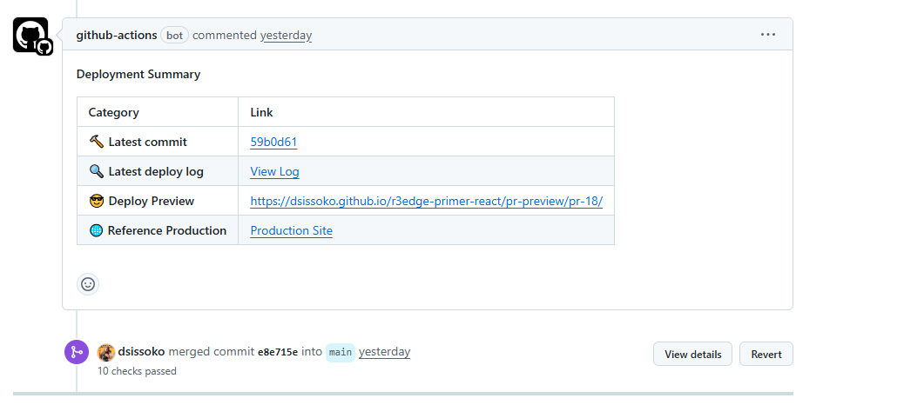

# r3edge Primer React Template | 

**Un template de démarrage pour React, suralimenté pour des déploiements multi-plateformes fluides.**

> 🚀 **Pourquoi utiliser ce template ?**
> 
> ✅ **Fondation Solide** : Basé sur le template officiel [Primer React](https://github.com/primer/react-template) de GitHub.    
> ✅ **Déploiement Universel** : Pré-configuré pour un déploiement en un clic sur Vercel, Netlify, GitHub Pages et Docker Hub.  
> ✅ **Pipeline CICD moderne** : 1 commit déclenche 1 build et 1 deploy, 1 Pull Request génére des environnements de preview accessibles sur Vercel, Netlify et Github Pages.  
> ✅ **Environnement de développement moderne** : Entièrement compatible avec GitHub Codespaces ou le développement local sous VSC.  
> ✅ **Usage de bots** : Maintenez vos dépendances à jour en permanence avec Dependabot, codez vos évolutions à l'aide de gemini clin ou Open Hands  

This README is also available in English 🇺🇸 here: [👉 docs/README_en.md](../README_fr.md)

---

## 📋 Fonctionnalités clés

- ✅ **Template d'une Stack Moderne** : React 19 + Vite + Primer.
- ✅ **Routage Standard** : Utilise `react-router-dom` pour un contrôle total et une flexibilité maximale.
- ✅ **Déploiement Simplifié** : Fichiers de configuration `vercel.json` et `netlify.toml` inclus.
- ✅ **Workflow CI/CD** : Action GitHub prête à l'emploi pour construire et déployer sur GitHub Pages.

---

## ⚙️ Démarrage Rapide

Cliquez sur **Use this template** > **Create a new repository**.
Choisissez le nom de votre projet et sa visibilité
> ⚠️ Github Pages ne fonctionnent pas sur les dépôts privés gratuits.

### Pour le développement

- Avec CodeSpaces :

    `<> Code` > onglet `Codespaces` > `Create codespace on main`

- Avec VSC en local: 

    ```bash
    git clone https://github.com/VOTRE_USER/VOTRE_REPO.git
    cd VOTRE_REPO
    ```
    Lancez VSC et ouvrez un terminal puis:
    ```bash
    npm install
    npm run dev
    ```
---

### Le 1er build & Deploy

une fois votre dépôt créé, Github va générer un 1er commit intitulé “Initial commit” et le pousser sur main. C’est ce push qui déclenche le workflow de l'action deploy.yml automatiquement.
Cette action est constituée de 4 jobs:
 1. le build du code react
 2. le déploiement en production sur github pages
 3. le déploiement en preview sur github pages
 4. la construction d'un container et son upload sur DOcker Hub

 Lors du 1er commit, étant donné que vous n'avez pas encore configuré votre dépôt, le job docker échoue, le job deploy preview est skippé car il n'est déclenché que sur Pull request. Et donc le Workflow "Deploy & Preview" est en échec et c'est normal car il faut configurer maintenant votre dépôt Github pour profiter de toutes les features de **r3edge-primer-react**.



### 📌 Configuration Post-Clonage

#### 1. Configuration de GitHub Pages (Crucial)

Ce template utilise une stratégie de déploiement sur une branche dédiée nommée `gh-pages`. C'est la méthode la plus robuste pour gérer à la fois un site de production et des environnements de prévisualisation temporaires pour les Pull Requests.

**Le concept de la branche `gh-pages` :**
-   Votre branche `main` contient le **code source** de votre application (React, JSX, etc.).
-   La branche `gh-pages` contient le **site web compilé et prêt à être servi** (fichiers HTML, CSS, JS purs).
-   Le workflow GitHub Actions se charge de compiler le code de `main` et de pousser le résultat sur `gh-pages` automatiquement.

**Actions requises :**

1.  Allez dans les paramètres de votre dépôt : `Settings` > `Pages`.
2.  Dans la section `Build and deployment`, sous `Source`, sélectionnez **`Deploy from a branch`**.
3.  Dans les menus déroulants qui apparaissent, configurez :
    -   **Branch** : `gh-pages`
    -   **Folder** : `/(root)`
4.  Cliquez sur **Save**.

Cette configuration unique indique à GitHub de servir le contenu de la branche `gh-pages` comme votre site web.

#### 2. Configuration des Secrets pour les Workflows

Le workflow a besoin de secrets pour se connecter à des services externes comme Docker Hub.

1.  Allez dans les paramètres de votre dépôt : `Settings` > `Secrets and variables` > `Actions`.
2.  Cliquez sur `New repository secret` et ajoutez les secrets suivants :
    -   `DOCKERHUB_USERNAME` : Votre nom d'utilisateur Docker Hub.
    -   `DOCKERHUB_TOKEN` : Un [token d'accès personnel](https://hub.docker.com/settings/security) Docker Hub avec les permissions `Read & Write`.

Le secret `GITHUB_TOKEN` est fourni automatiquement par GitHub et n'a pas besoin d'être configuré.

#### 3. Configuration pour Vercel et Netlify

Ce template est prêt à être déployé sur Vercel et Netlify.

1.  Créez un nouveau projet sur Vercel ou Netlify.
2.  Liez votre dépôt GitHub.
3.  Les plateformes détecteront automatiquement les fichiers de configuration (`vercel.json` ou `netlify.toml`) et appliqueront les bons paramètres de build (`npm run build`) et le bon dossier de sortie (`dist`).

> **Note importante pour Vercel :**  
> Par défaut, Vercel essaiera de construire et de déployer *chaque* branche, y compris la branche `gh-pages` utilisée par notre workflow GitHub Actions. Cela provoquera une erreur, car `gh-pages` contient un site déjà construit, et non du code source.
>
> Pour corriger cela, vous devez indiquer à Vercel d'ignorer cette branche :
> 1.  Dans les paramètres de votre projet Vercel, allez à `Settings` > `Git`.
> 2.  Trouvez la section **Ignored Build Step**.
> 3.  Dans le champ de commande, collez la ligne suivante :
>     ```bash
>     if [[ "$VERCEL_GIT_COMMIT_REF" == "gh-pages" ]] ; then exit 0; else exit 1; fi
>     ```
> 4.  Sauvegardez. Cela annulera proprement les builds pour la branche `gh-pages` sans générer d'erreur.

Ces plateformes gèrent nativement les prévisualisations de Pull Requests (pour les branches de feature), vous n'avez rien de plus à configurer pour cette partie.

#### 4. Cycle de Vie et Nettoyage des Prévisualisations

Il est important de comprendre que les plateformes hébergées et notre solution sur GitHub Pages ne gèrent pas le nettoyage des anciens environnements de prévisualisation de la même manière :

-   **Vercel :** Le cycle de vie d'une prévisualisation est lié à sa branche Git. Lorsque vous **supprimez la branche** après avoir mergé une Pull Request, Vercel supprime automatiquement tous les déploiements de prévisualisation qui y étaient associés.

-   **Netlify :** Le cycle de vie est lié à la Pull Request elle-même. Lorsque vous **fermez ou mergez la Pull Request**, Netlify supprime automatiquement le "Deploy Preview" correspondant.

-   **GitHub Pages (notre solution) :** Il n'y a **aucun nettoyage automatique**. Les dossiers de prévisualisation (ex: `/pr-preview/pr-123/`) créés sur la branche `gh-pages` **persisteront** même après la fermeture de la PR. C'est un comportement intentionnel de notre workflow actuel pour conserver un historique, mais qui peut être modifié pour inclure une étape de nettoyage si nécessaire.

Une fois ces étapes terminées, votre dépôt cloné se comportera exactement comme le template original, avec des déploiements et des prévisualisations sur PR entièrement automatisés.

#### 5. Déclencheurs du Workflow

-   **Push sur `main`** : Déclenche le déploiement en production.
-   **Pull Request vers `main`** : Déclenche le déploiement d'un environnement de prévisualisation.

#### 6. Actions en Production (sur `main`)

1.  **Déploiement sur GitHub Pages** : Le site est mis à jour sur sa branche principale.
    -   URL de production : [https://dsissoko.github.io/r3edge-primer-react/](https://dsissoko.github.io/r3edge-primer-react/)
2.  **Publication sur Docker Hub** : Une nouvelle image Docker `latest` est construite et poussée sur Docker Hub.

#### 7. Prévisualisation des Pull Requests

-   Pour chaque Pull Request ouverte, une **version de prévisualisation** du site est automatiquement déployée sur une URL unique
-   Le workflow poste un **commentaire dans la PR** avec un lien direct vers cet environnement, permettant une revue visuelle immédiate des changements: Exemple d'URL de preview : [https://dsissoko.github.io/r3edge-primer-react/pr-preview/pr-19/](https://dsissoko.github.io/r3edge-primer-react/pr-preview/pr-19/).



### 📌 Déploiement par Conteneur (Docker)

Cette sous-section décrit comment construire et exécuter l'application en tant que conteneur Docker.

#### 1. Prérequis

1.  **Docker** : Assurez-vous que Docker est installé et en cours d'exécution sur votre machine.
2.  **Authentification Docker Hub** : Vous devez avoir un compte Docker Hub et être connecté via votre terminal.

#### 2. Configuration Initiale (à faire une seule fois)

1.  **Créez votre fichier de configuration :**
    Copiez le fichier d'exemple `.env.example` pour créer votre propre configuration locale.
    ```bash
    cp docker/.env.example docker/.env
    ```
    Modifiez ensuite le fichier `docker/.env` pour y mettre votre nom d'utilisateur Docker Hub.

2.  **Connectez-vous à Docker Hub :**
    Exécutez cette commande et entrez votre nom d'utilisateur et votre **token d'accès personnel** (recommandé) lorsque vous y êtes invité.
    ```bash
    docker login
    ```

#### 3. Build de l'Image

Le projet inclut un script pour simplifier le processus de build.

1.  **Rendez le script exécutable (si ce n'est pas déjà fait) :**
    ```bash
    chmod +x docker/build.sh
    ```

2.  **Lancez le script de build :**
    Ce script construira l'image et vous demandera si vous souhaitez la pousser sur Docker Hub.
    ```bash
    ./docker/build.sh
    ```

#### 4. Lancement de Conteneur

Une fois l'image construite, vous pouvez la lancer localement.

1.  **Exécutez la commande `docker run` :**
    Cette commande démarre le conteneur, mappe le port 80 du conteneur au port 8080 de votre machine, et injecte une URL d'API backend.
    ```bash
    docker run -p 8080:80 \
      -e BACKEND_API_URL="https://votre-app.domaine.com/api" \
      votrenomdutilisateur/r3edge-primer-react:latest
    ```

2.  **Accédez à l'application :**
    Ouvrez votre navigateur et allez sur `http://localhost:8080`.

---

## 📦 Stack de référence

✅ Cette application s'appuie sur :

- Node 20 (build via Docker)
- React 19.1 + React DOM 19
- Vite 7 + `@vitejs/plugin-react`
- Primer React 37 & `@primer/octicons-react`
- React Router DOM 7
- Styled-components 5
- ESLint 9 + PostCSS 10
- Nginx (serveur de production)

---

## 🗺️ Roadmap

### 🔧 À venir
- Exemples de tests unitaires (Vitest + React Testing Library)

### 🧠 En réflexion
- Bots IA Open Hands et Gemini Cli

---

📫 Maintenu par [@dsissoko](https://github.com/dsissoko) – Ce projet est une évolution du template officiel [Primer React](https://github.com/primer/react-template).

[](https://github.com/dsissoko/r3edge-primer-react/actions/workflows/dependabot/dependabot-updates) [](https://github.com/dsissoko/r3edge-primer-react/actions/workflows/deploy.yml) [](https://app.netlify.com/projects/r3edge-primer-react/deploys)
